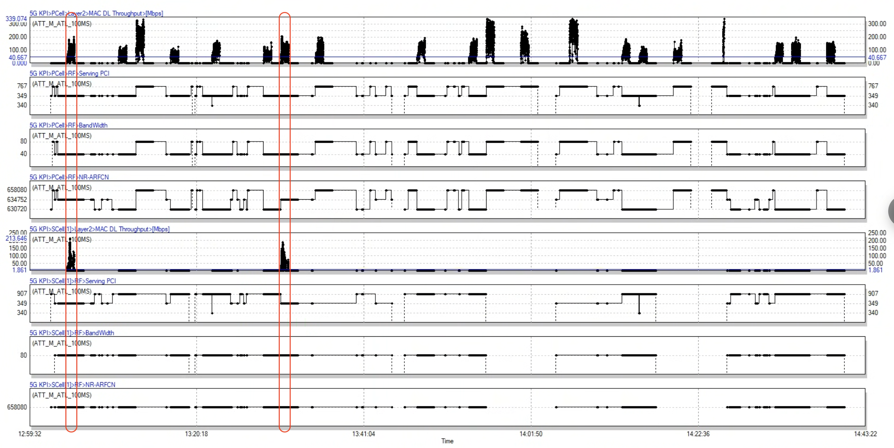
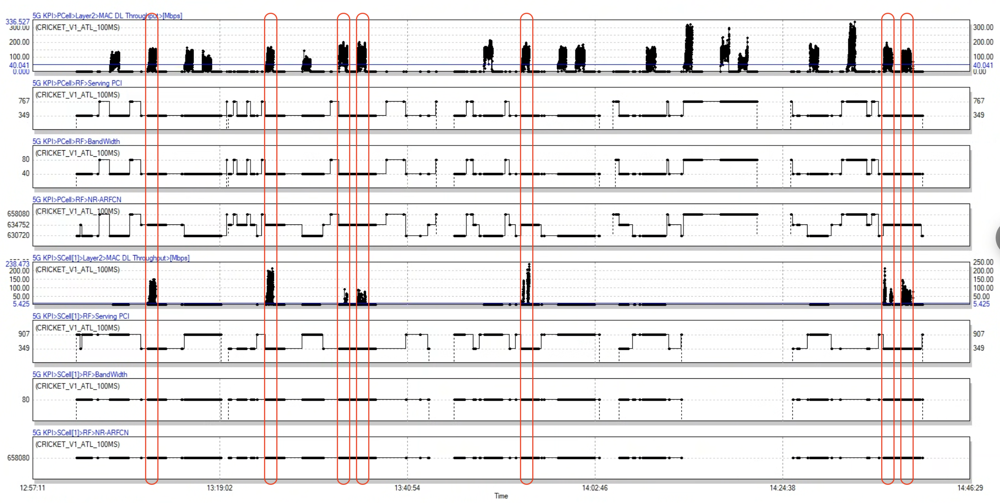
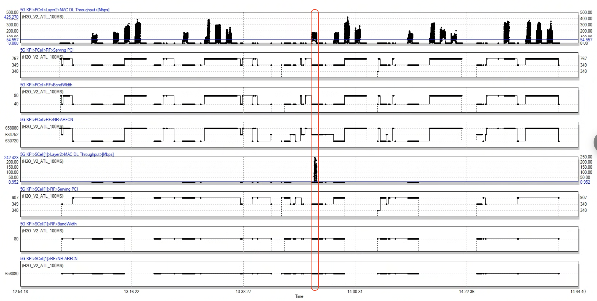
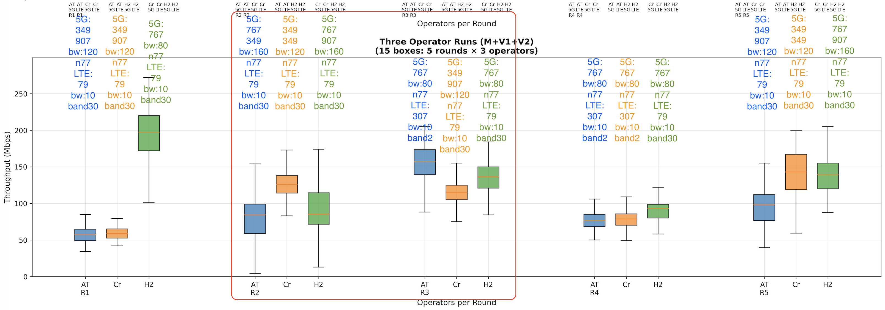

# ATT(M) & Cricket(V1) & H2O(V2)
## Atlanta
### Location 2 DL
#### Question 1: Why PCI 767 is the best, why 349+349 is good, and why 349+others is bad?
- 767 is the best primary cell, it has 80MHz bandwidth. Other primary cells have only 40MHz.
- Secondary cells did not work except for 349+349.

- Secondary channel is bad for 349+349 and it cannot contribute a lot throughput.
    ||ARFCN|BW|Avg CQI|Avg SINR|Avg MCS|Avg RBs|Avg Tp|
    |:---:|:---:|:---:|:---:|:---:|:---:|:---:|:---:|
    |ATT PCell: 349|634752|40MHz|6|7|12|60|100Mbps|
    |ATT SCell: 349|658080|80MHz|4|-7|6|80|40Mbps|
    |Cricket PCell: 349|634752|40MHz|5|7.6|11|63|103Mbps|
    |Cricket SCell: 349|658080|80MHz|5|-9.7|11|45|39Mbps|
    |H2O PCell: 349|634752|40MHz|7.3|3.5|13|75|133Mbps|
    |H2O SCell: 349|658080|80MHz|2.6|-7.6|8|42|20Mbps|

#### Question 2: Why 767 is better than 767+others?
- Connecting to a secondary cell may harm the primary cell, even if the secondary cell does not work.

    R2S5 vs R3S5: M & V2
    
    ||ARFCN|BW|Avg CQI|Avg SINR|Avg MCS|Avg RBs|Avg Tp|
    |:-:|:-:|:-:|:-:|:-:|:-:|:-:|:-:|
    |M_R2: 767(349)|658080|80MHz|7.2|7|12|65|84Mbps|
    |M_R3: 767|658080|80MHz|6.5|7|10|82|140Mbps|
    |V2_R2: 767(907)|658080|80MHz|7.2|4|11|69|91Mbps|
    |V2_R3: 767|658080|80MHz|6.7|4.6|11|82|140Mbps|