# Overall measurement analysis

This note consolidates **per-round win counts** (highest iperf throughput among carriers with valid samples in the same round) for the three operator families, and embeds **summary figures** used in the paper draft. Data ranges follow each family’s `valid_data_range.txt` and analysis scripts under `CarriersMeasurement`.

---

## 1. Per-round win statistics

### 1.1 Family A — Verizon (M: PA, V1: VA1, V2: VA2)

Tables are generated from `Verizon/verizon_overall_analysis.py` (`VALID`; Same PCI ∪ Diff PCI per scenario).

#### Downlink (DL)

| Scenario | QCI | Total rounds | M(PA) | V1(VA1) | V2(VA2) |
|:---:|:---:|:---:|:---:|:---:|:---:|
| Isolated Running | 8 & 8 & 9 | 10 | 8 | 1 | 1 |
| M vs V1 | 8 vs 8 | 49 | 29 | 20 | - |
| M vs V2 | 8 vs 9 | 10 | 9 | - | 1 |
| V1 vs V2 | 8 vs 9 | 10 | - | 10 | 0 |
| Running Simultaneously | 8 vs 8 vs 9 | 10 | 9 | 1 | 0 |

#### Uplink (UL)

| Scenario | QCI | Total rounds | M(PA) | V1(VA1) | V2(VA2) |
|:---:|:---:|:---:|:---:|:---:|:---:|
| Isolated Running | 8 & 8 & 9 | 10 | 2 | 4 | 4 |
| M vs V1 | 8 vs 8 | 44 | 11 | 33 | - |
| M vs V2 | 8 vs 9 | 10 | 3 | - | 7 |
| V1 vs V2 | 8 vs 9 | 10 | - | 8 | 2 |
| Running Simultaneously | 8 vs 8 vs 9 | 10 | 3 | 7 | 0 |

---

### 1.2 Family B — AT&T (M: PB, V1: VB1, V2: VB2)

Tables are generated from `ATNT/att_overall_analysis.py` (`VALID`; Same PCI ∪ Diff PCI per scenario).

#### Downlink (DL)

| Scenario | QCI | Total rounds | M(PB) | V1(VB1) | V2(VB2) |
|:---:|:---:|:---:|:---:|:---:|:---:|
| Isolated Running | 8 & 8 & 8 | 19 | 4 | 9 | 6 |
| M vs V1 | 8 vs 8 | 27 | 13 | 14 | - |
| M vs V2 | 8 vs 8 | 17 | 11 | - | 6 |
| V1 vs V2 | 8 vs 8 | 19 | - | 8 | 11 |
| Running Simultaneously | 8 vs 8 vs 8 | 17 | 8 | 3 | 6 |

#### Uplink (UL)

| Scenario | QCI | Total rounds | M(PB) | V1(VB1) | V2(VB2) |
|:---:|:---:|:---:|:---:|:---:|:---:|
| Isolated Running | 8 & 8 & 8 | 25 | 9 | 6 | 10 |
| M vs V1 | 8 vs 8 | 37 | 25 | 12 | - |
| M vs V2 | 8 vs 8 | 20 | 8 | - | 12 |
| V1 vs V2 | 8 vs 8 | 20 | - | 6 | 14 |
| Running Simultaneously | 8 vs 8 vs 8 | 19 | 6 | 4 | 9 |

---

### 1.3 Family C — T-Mobile (M: PC, V1: VC1, V2: VC2)

Per-round winner = carrier with highest iperf throughput among carriers with valid samples in that round (`≥2` carriers with data). Ranges match `TMobile/valid_data_range.txt` as encoded in `tmobile_pci_qci_analysis.py`.

#### DL — all valid rounds (QCI 677/67/77 ∪ QCI 999/99)

| Scenario | Total rounds | M(PC) | V1(VC1) | V2(VC2) |
|:---:|:---:|:---:|:---:|:---:|
| Isolated Running | 39 | 15 | 12 | 12 |
| M vs V1 | 39 | 22 | 17 | - |
| M vs V2 | 38 | 21 | - | 17 |
| V1 vs V2 | 40 | - | 16 | 24 |
| Running Simultaneously | 36 | 15 | 9 | 12 |

#### UL — all valid rounds (file currently lists only QCI 677 / 67 / 77 uplink ranges)

| Scenario | Total rounds | M(PC) | V1(VC1) | V2(VC2) |
|:---:|:---:|:---:|:---:|:---:|
| Isolated Running | 32 | 10 | 17 | 5 |
| M vs V1 | 32 | 14 | 18 | - |
| M vs V2 | 28 | 20 | - | 8 |
| V1 vs V2 | 33 | - | 19 | 14 |
| Running Simultaneously | 29 | 6 | 18 | 5 |

#### DL — QCI 677 / 67 / 77

| Scenario | Total rounds | M(PC) | V1(VC1) | V2(VC2) |
|:---:|:---:|:---:|:---:|:---:|
| Isolated Running | 14 | 7 | 3 | 4 |
| M vs V1 | 14 | 8 | 6 | - |
| M vs V2 | 13 | 10 | - | 3 |
| V1 vs V2 | 15 | - | 5 | 10 |
| Running Simultaneously | 11 | 7 | 2 | 2 |

#### DL — QCI 999 / 99

| Scenario | Total rounds | M(PC) | V1(VC1) | V2(VC2) |
|:---:|:---:|:---:|:---:|:---:|
| Isolated Running | 25 | 8 | 9 | 8 |
| M vs V1 | 25 | 14 | 11 | - |
| M vs V2 | 25 | 11 | - | 14 |
| V1 vs V2 | 25 | - | 11 | 14 |
| Running Simultaneously | 25 | 8 | 7 | 10 |

#### UL — QCI 677 / 67 / 77

| Scenario | Total rounds | M(PC) | V1(VC1) | V2(VC2) |
|:---:|:---:|:---:|:---:|:---:|
| Isolated Running | 32 | 10 | 17 | 5 |
| M vs V1 | 32 | 14 | 18 | - |
| M vs V2 | 28 | 20 | - | 8 |
| V1 vs V2 | 33 | - | 19 | 14 |
| Running Simultaneously | 29 | 6 | 18 | 5 |

#### UL — QCI 999 / 99

*No uplink rounds are listed under QCI 999/99 in `valid_data_range.txt`; totals are 0.*

| Scenario | Total rounds | M(PC) | V1(VC1) | V2(VC2) |
|:---:|:---:|:---:|:---:|:---:|
| Isolated Running | 0 | 0 | 0 | 0 |
| M vs V1 | 0 | 0 | 0 | - |
| M vs V2 | 0 | 0 | - | 0 |
| V1 vs V2 | 0 | - | 0 | 0 |
| Running Simultaneously | 0 | 0 | 0 | 0 |

---

## 2. Figures

### 2.1 Cross-family summary

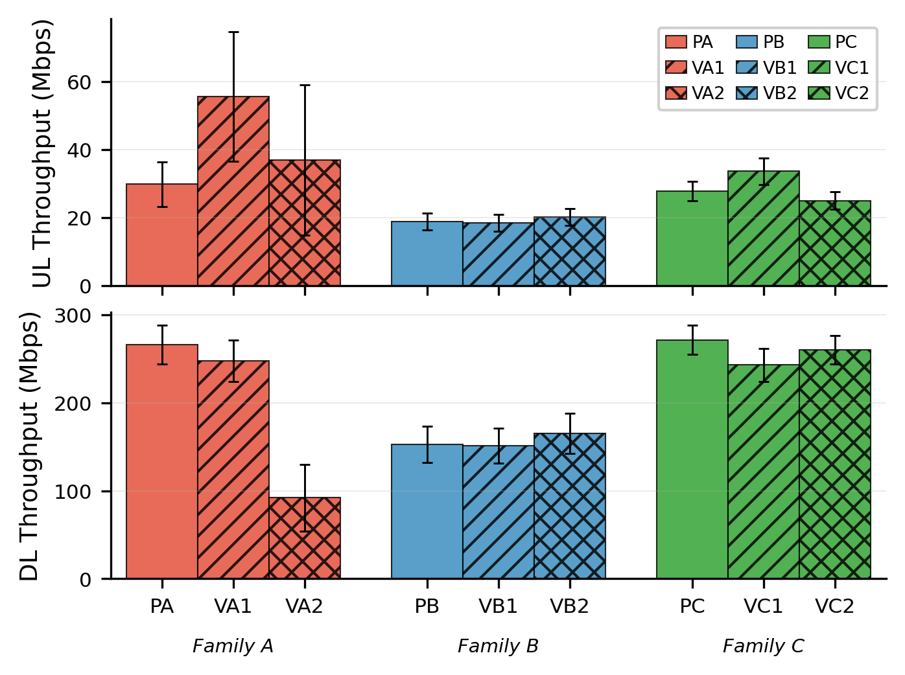

**Figure 1.** Mean downlink and uplink iperf throughput (Mbps) with 95% confidence intervals for every carrier role across three host families (Verizon, AT&T, T-Mobile), aggregating all valid measurement rounds defined in each family’s analysis script.

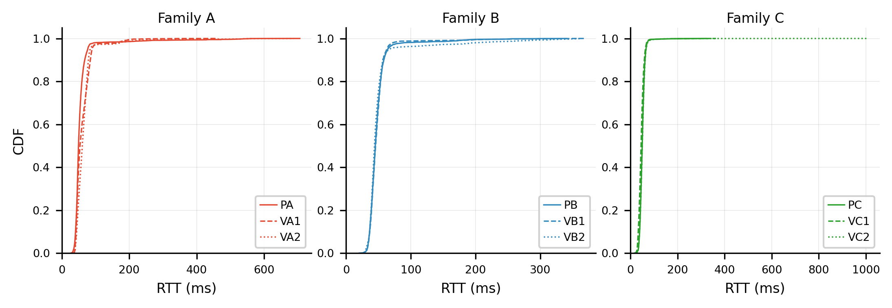

**Figure 2.** Empirical cumulative distribution of ping RTT (ms) per carrier, pooled over available RTT logs in the combined dataset; line styles distinguish host vs. virtual operators within each family.

---

### 2.2 Family A — Verizon

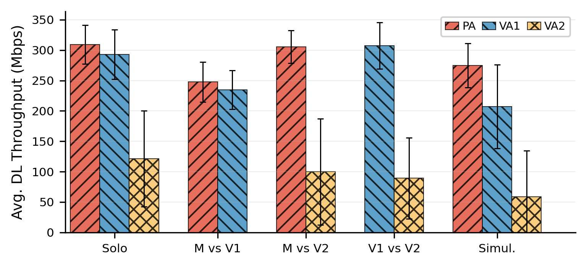

**Figure 3.** Verizon family: mean DL throughput (Mbps) per scenario (Solo, M vs V1, …) for PA (host), VA1, and VA2; error bars show 95% CI over valid rounds (Boston + Atlanta).

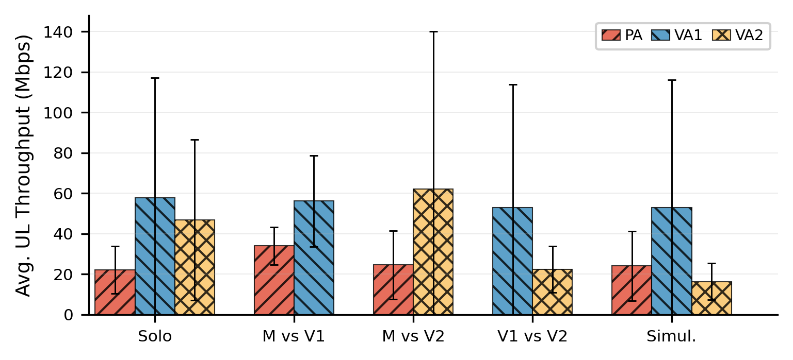

**Figure 4.** Verizon family: mean UL throughput (Mbps) with the same scenario layout and statistics as Figure 4.

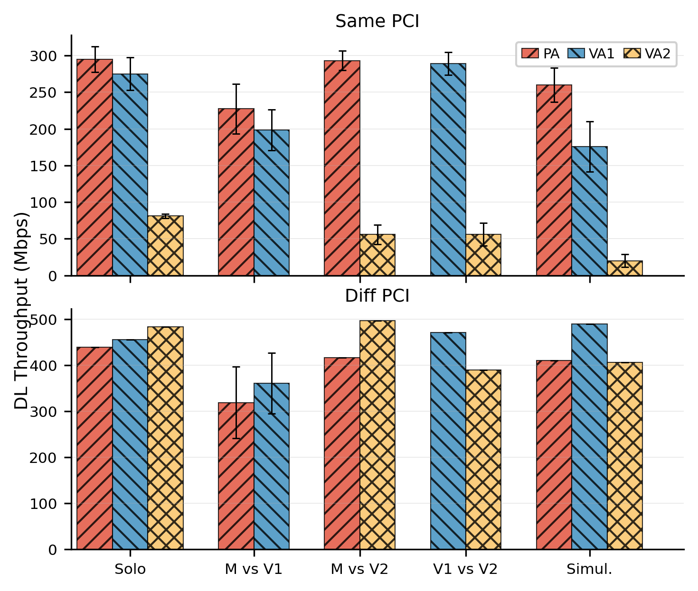

**Figure 5.** Verizon family DL: stacked panels comparing **Same PCI** (top) vs **Diff PCI** (bottom) subsets from `valid_data_range.txt`; bars are means with 95% CI.

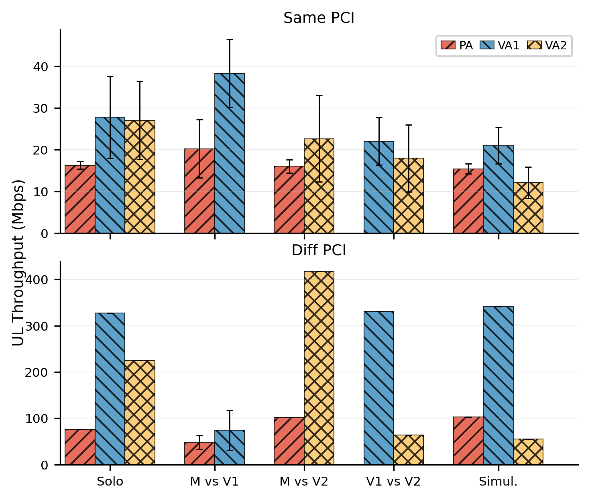

**Figure 6.** Verizon family UL: same Same/Diff PCI layout as Figure 6 for uplink traffic.

---

### 2.3 Family B — AT&T

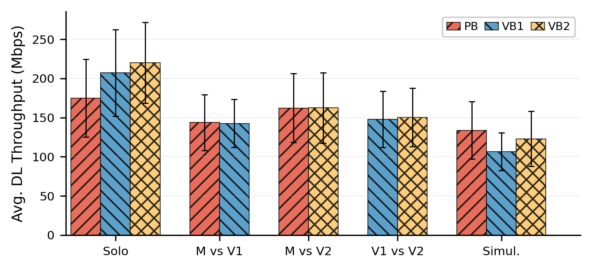

**Figure 7.** AT&T family: mean DL throughput (Mbps) for PB, VB1, and VB2 across scenarios; 95% CI from valid Boston + Atlanta rounds.

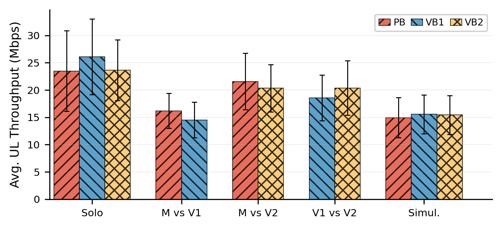

**Figure 8.** AT&T family: mean UL throughput (Mbps) with the same grouping as Figure 8.

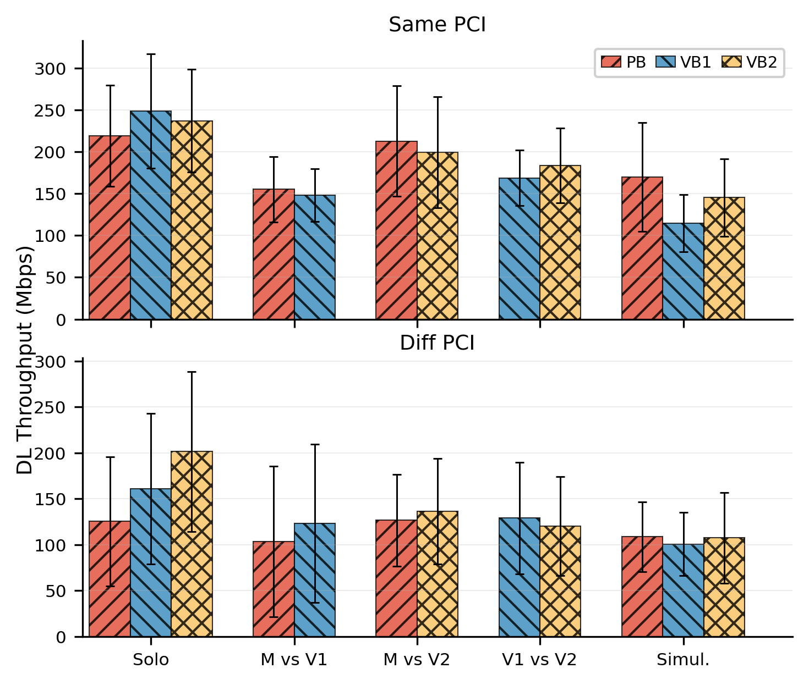

**Figure 9.** AT&T family DL: **Same PCI** vs **Diff PCI** stacked bar comparison (means ± 95% CI), per `ATNT/valid_data_range.txt`.

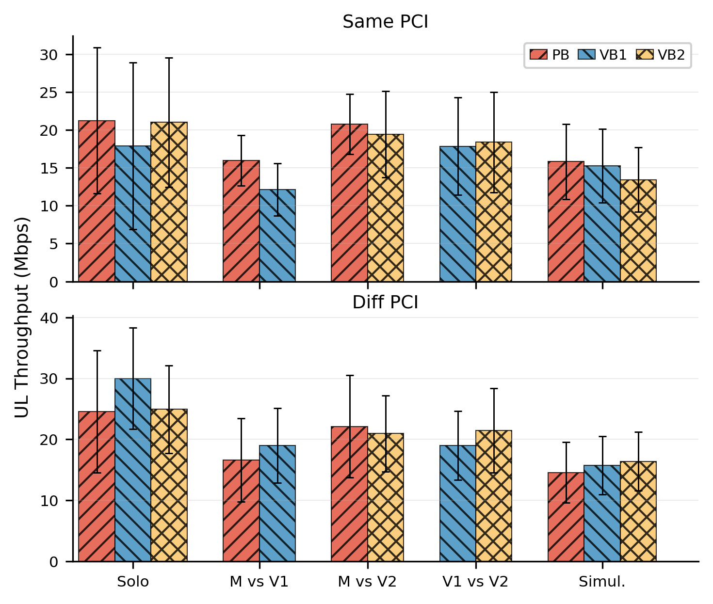

**Figure 10.** AT&T family UL: Same/Diff PCI split analogous to Figure 10.

---

### 2.4 Family C — T-Mobile

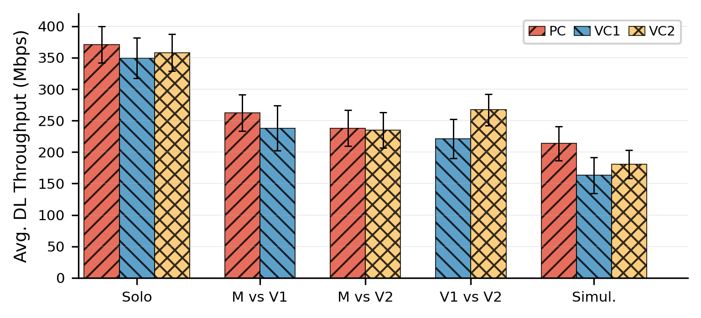

**Figure 11.** T-Mobile family: mean DL throughput (Mbps) for PC, VC1, and VC2 over Boston (DL) + Philadelphia valid rounds.

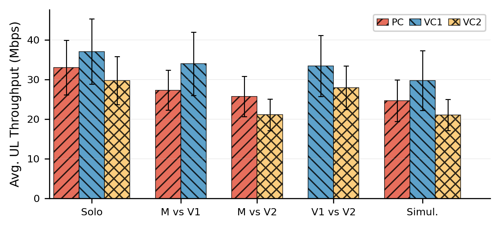

**Figure 12.** T-Mobile family: mean UL throughput (Mbps); Boston uses dedicated UL measurement trees, Philadelphia shares main paths per `valid_data_range.txt`.

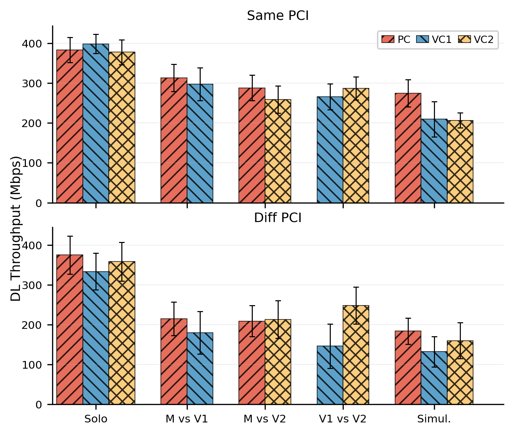

**Figure 13.** T-Mobile family DL: **Same PCI** (top) vs **Diff PCI** (bottom) with means and 95% CI, following encoded PCI ranges in `TMobile/valid_data_range.txt`.

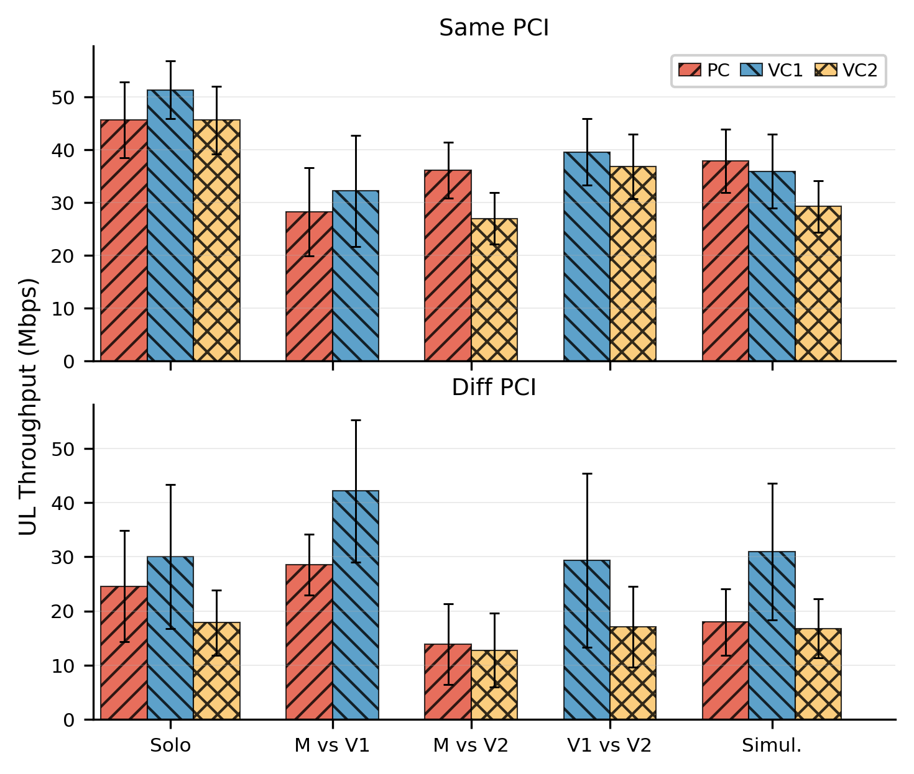

**Figure 14.** T-Mobile family UL: Same/Diff PCI layout as Figure 14 for uplink.

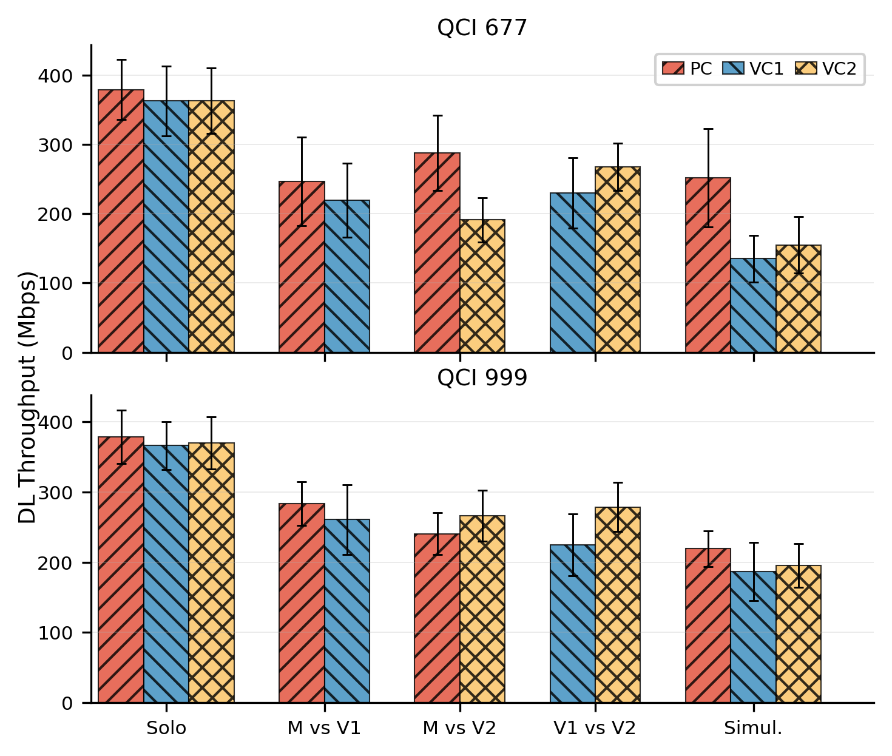

**Figure 15.** T-Mobile family DL: **QCI 677-class** (67/77, top) vs **QCI 999-class** (99, bottom); each panel pools Same+Diff PCI rounds within that QCI bucket.

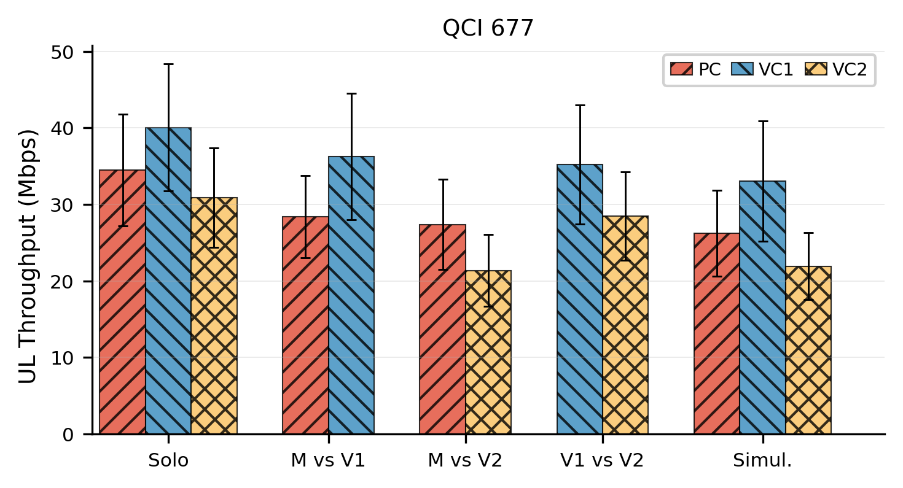

**Figure 16.** T-Mobile family UL: **QCI 677-class** only (single panel); no uplink QCI 999-class rounds are defined in the current valid-range file, so no second panel is shown.

---

*Source tables: `Verizon/statistic.md`, `ATNT/statistic.md`, `TMobile/statistic.md`. Figures copied to `NEU-VMNOs/Paper_images/` for this document.*
